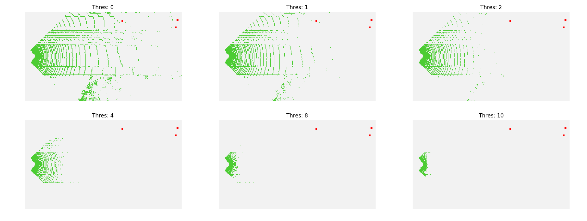
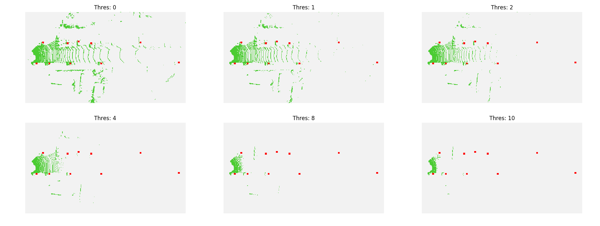
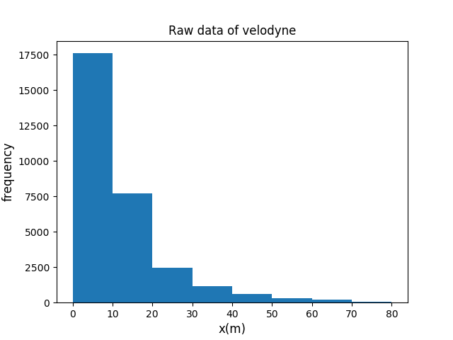
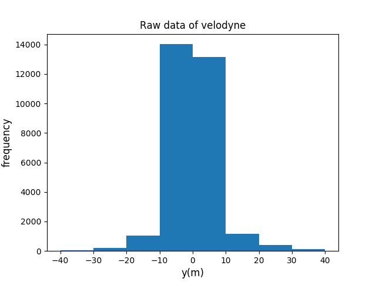

# VoxelNet implementation in Chainer
Reference:
- VoxelNet [link](https://arxiv.org/pdf/1711.06396.pdf)

# Prepare datasets
## KITTI dataset
- 3D Detection Dataset [link](http://www.cvlibs.net/datasets/kitti/eval_object.php?obj_benchmark=3d)  
- (in data folder) train/val split [link](http://www.cs.toronto.edu/objprop3d/downloads.php)
```
cp data/*.txt dataset/ImageSets/
```

# Execution
```
######## Training on the kitti dataset ########
python train.py experiments/orig_voxelnet/orig_voxelnet_single.yml

######## Evaluation on the kitti dataset ########
python evaluation.py experiments/orig_voxelnet/orig_voxelnet_eval.yml --gpu 0 --nms_thresh 0.5 --thresh 0.5

・Split gt and result files into train/val
python parse_dataset.py val.txt --gt_dir dataset/label_2/ --result_dir results/ --out_dir ../out/

・Provided on the KITTI competition
cd devkit_object/cpp
g++ -O3 -DNDEBUG -o evaluate_object evaluate_object.cpp -lboost_system -lboost_filesystem
cd ../.. && ./devkit_object/cpp/evaluate_object ./out/result ./out/gt

######## Inference on the kitti dataset ########
python demo.py experiments/orig_voxelnet/orig_voxelnet_demo.yml --gpu 0

######## Visualize on the kitti dataset ########
・Compate inputs for network by threshold
python visualize.py --type input --config experiments/orig_voxelnet/orig_voxelnet_viz.yml
・Calculate statistic of raw data
python visualize.py --type stats --config experiments/orig_voxelnet/orig_voxelnet_stats.yml
```

# Compare inputs for network by threshold




# Statistic of raw data



# Requirement
- Python3
- Chainer
- Cupy
- ChainerCV
- OpenCV
